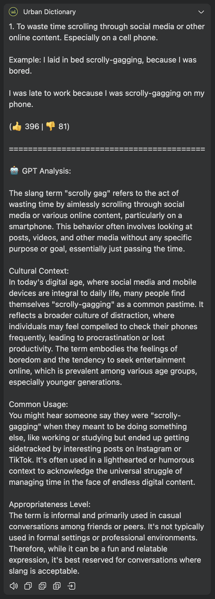

# Urban Dictionary for Bob

A plugin for [Bob](https://bobtranslate.com/) that allows you to quickly look up slang meanings on Urban Dictionary with enhanced GPT analysis.

_Read this in [简体中文](README_zh-cn.md)_


## Features

- 🔍 Directly search English slang, internet terminology, and informal expressions from Urban Dictionary within Bob
- 🎯 Get top-rated definitions sorted by popularity (up to 3 displayed)
- 📊 View upvote and downvote statistics for each definition
- 🌐 Support for multiple target languages: Simplified Chinese, Traditional Chinese, Japanese, Korean, French, German, Spanish, and Russian
- 🤖 Integrated OpenAI GPT analysis providing deeper cultural context, usage scenarios, and appropriateness level
- 📱 Seamless integration with Bob's translation features

## Installation

### Prerequisites

- macOS device
- [Bob](https://bobtranslate.com/) app installed (v0.5.0 or higher)

### Installation Steps

1. Download the latest `.bobplugin` file from the [Releases](https://github.com/a322655/bob-plugin-urban-dictionary/releases) page
2. Double-click the downloaded file to install it in Bob
3. Enable the plugin in Bob preferences (if you need the GPT analysis feature, add your OpenAI API key in the plugin settings)

## Usage

1. Select or input the English slang or phrase you want to look up
2. Activate Bob (via hotkey or menu bar)
3. Bob will display Urban Dictionary definitions along with optional GPT analysis

**Example queries**:

- "throw shade"
- "yeet"
- "Karen"
- "Netflix and chill"
- "sus"



## Configuration Options

The plugin provides the following configuration options:

| Option         | Description                                | Required                     |
| -------------- | ------------------------------------------ | ---------------------------- |
| OpenAI API Key | API key for GPT analysis feature           | Yes (for GPT analysis only)  |
| OpenAI Model   | Select which GPT model to use for analysis | No (defaults to gpt-4o-mini) |

Available GPT model options:

- **GPT-4o-mini** (recommended for balance of cost and quality)
- **GPT-4o** (highest quality but more expensive)
- **GPT-3.5-turbo** (lower cost but potentially lower quality analysis)

## Contributing

Contributions via Pull Requests and Issues are welcome!

1. Fork the repository
2. Create your feature branch (`git checkout -b feature/amazing-feature`)
3. Commit your changes (`git commit -m 'Add some amazing feature'`)
4. Push to the branch (`git push origin feature/amazing-feature`)
5. Open a Pull Request

## Testing

1. Clone the repository to your local machine
2. Use the provided build script to create the plugin package:
   ```bash
   ./build.sh
   ```
3. Double-click the generated `.bobplugin` file to install it in Bob for testing
4. Test the functionality with various types of slang and phrases

## License

This project is licensed under the MIT License - see the [LICENSE](LICENSE) file for details

## Acknowledgements

- [Urban Dictionary](https://www.urbandictionary.com/) - For providing slang definition data
- [OpenAI](https://openai.com/) - For providing GPT analysis capabilities
- [Bob App](https://bobtranslate.com/) - For providing an excellent translation platform and plugin system
