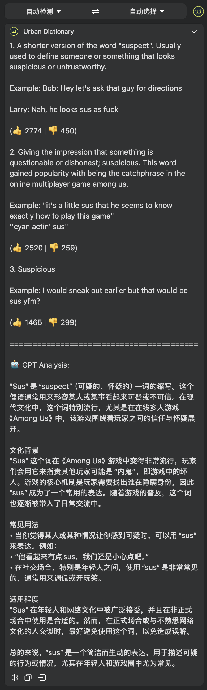

# Urban Dictionary for Bob

一款为 [Bob](https://bobtranslate.com/) 开发的插件，让你可以在 Bob 中快速查询 Urban Dictionary 上的俚语解释，并且通过 GPT 提供深入分析。


## 功能特点

- 🔍 直接在 Bob 中搜索 Urban Dictionary 上的英语俚语、网络用语和非正式表达
- 🎯 获取按点赞数排序的最流行定义（最多显示 3 个）
- 📊 自动包含定义的点赞数和踩数统计
- 🌐 支持多种目标语言：简体中文、繁体中文、日语、韩语、法语、德语、西班牙语和俄语
- 🤖 集成 OpenAI GPT 分析，提供更深入的文化背景、使用场景和适用场合解释
- 📱 无缝集成 Bob 的翻译功能

## 安装说明

### 前提条件

- macOS 设备
- 已安装 [Bob](https://bobtranslate.com/) 应用（v0.5.0 或更高版本）

### 安装步骤

1. 从 [Releases](https://github.com/a322655/bob-plugin-urban-dictionary/releases) 页面下载最新的 `.bobplugin` 文件
2. 双击下载的文件以在 Bob 中安装插件
3. 在 Bob 偏好设置中启用该插件（如果需要 GPT 分析功能，请在插件设置中添加你的 OpenAI API 密钥）

## 使用示例

1. 选中或输入你想查询的英语俚语或短语
2. 激活 Bob（通过快捷键或菜单栏）
3. Bob 将显示 Urban Dictionary 的定义以及可选的 GPT 分析

**示例查询**：

- "throw shade"
- "yeet"
- "Karen"
- "Netflix and chill"
- "sus"



## 配置选项

插件提供以下配置选项：

| 选项            | 描述                         | 必填                     |
| --------------- | ---------------------------- | ------------------------ |
| OpenAI API 密钥 | 用于 GPT 分析功能的 API 密钥 | 是（仅限 GPT 分析功能）  |
| OpenAI 模型     | 选择用于分析的 GPT 模型      | 否（默认为 gpt-4o-mini） |

可用的 GPT 模型选项：

- **GPT-4o-mini**（推荐，平衡成本和质量）
- **GPT-4o**（最高质量，但成本更高）
- **GPT-3.5-turbo**（成本较低，但分析质量可能较低）

## 贡献指南

欢迎提交 Pull Requests 和 Issues 来改进这个插件！

1. Fork 这个仓库
2. 创建你的功能分支 (`git checkout -b feature/amazing-feature`)
3. 提交你的更改 (`git commit -m 'Add some amazing feature'`)
4. 推送到分支 (`git push origin feature/amazing-feature`)
5. 开启一个 Pull Request

## 测试说明

1. 克隆仓库到本地
2. 使用提供的构建脚本创建插件包：
   ```bash
   ./build.sh
   ```
3. 双击生成的 `.bobplugin` 文件安装到 Bob 中进行测试
4. 使用各种类型的俚语和短语测试功能

## 许可证

该项目采用 MIT 许可证 - 详情请参阅 [LICENSE](LICENSE) 文件

## 致谢

- [Urban Dictionary](https://www.urbandictionary.com/) - 提供俚语定义数据
- [OpenAI](https://openai.com/) - 提供 GPT 分析功能
- [Bob 应用](https://bobtranslate.com/) - 提供出色的翻译平台和插件系统
