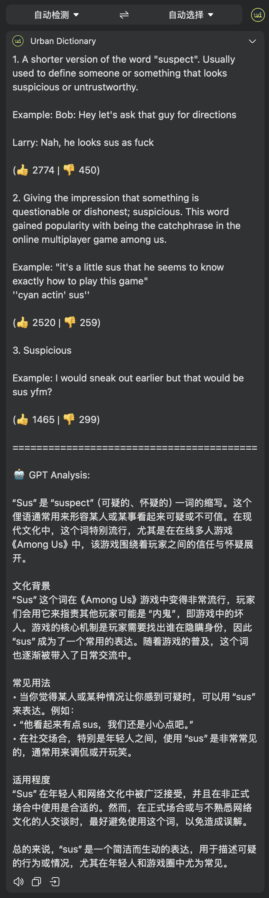

# Urban Dictionary for Bob

一款为 [Bob](https://bobtranslate.com/) 开发的插件，让你可以在 Bob 中快速查询 Urban Dictionary 上的俚语解释，并通过 OpenAI、Anthropic 或兼容提供商获得可选的 AI 深度分析。


## 功能特点

- 🔍 直接在 Bob 中搜索 Urban Dictionary 上的英语俚语、网络用语和非正式表达
- 🎯 获取按点赞数排序的最流行定义（最多显示 3 个）
- 📊 自动包含定义的点赞数和踩数统计
- 🌐 支持多种目标语言：简体中文、繁体中文、日语、韩语、法语、德语、西班牙语和俄语
- 🤖 集成 AI 分析，支持 OpenAI、Anthropic 以及兼容的自定义提供商
- 📱 无缝集成 Bob 的翻译功能

## 安装说明

### 前提条件

- macOS 设备
- 已安装 [Bob](https://bobtranslate.com/) 应用（v0.5.0 或更高版本）

### 安装步骤

1. 从 [Releases](https://github.com/a322655/bob-plugin-urban-dictionary/releases) 页面下载最新的 `.bobplugin` 文件
2. 双击下载的文件以在 Bob 中安装插件
3. 在 Bob 偏好设置中启用该插件（如果需要 AI 分析功能，请在插件设置中选择提供商并填写对应的 API 密钥）

## 使用示例

1. 选中或输入你想查询的英语俚语或短语
2. 激活 Bob（通过快捷键或菜单栏）
3. Bob 将显示 Urban Dictionary 的定义以及可选的 AI 分析

**示例查询**：

- "throw shade"
- "yeet"
- "Karen"
- "Netflix and chill"
- "sus"



## 配置选项

插件提供以下配置选项：

| 选项             | 描述                                                     | 必填                    |
| ---------------- | -------------------------------------------------------- | ----------------------- |
| AI 提供商        | 选择 OpenAI、Anthropic 或兼容的自定义提供商              | 否（默认 OpenAI）       |
| 自定义 Base URL  | 自定义 OpenAI 兼容或 Anthropic 兼容提供商的基础地址      | 仅自定义提供商必填      |
| API 密钥         | 所选提供商的 API 密钥                                    | AI 分析功能必填         |
| OpenAI 模型      | 选择 OpenAI 预设模型，或为其他提供商选择 Custom          | 否（默认 GPT-5.4）      |
| 自定义模型名称   | 在选择 Custom 或使用非 OpenAI 提供商时填写精确模型名     | 非 OpenAI 提供商必填    |

### 提供商支持

- **OpenAI**：使用 `https://api.openai.com/v1/responses` 的 Responses API。
- **Anthropic**：使用 `https://api.anthropic.com/v1/messages` 的 Messages API。
- **自定义（OpenAI 兼容）**：使用 `<baseUrl>/v1/chat/completions` 的 Chat Completions API。
- **自定义（Anthropic 兼容）**：使用 `<baseUrl>/v1/messages` 的 Messages API。

预设模型下拉菜单主要面向 OpenAI。对于 Anthropic 或自定义提供商，请选择 **Custom**，然后在 **自定义模型名称** 中填写精确模型名。

可用的 OpenAI 模型选项：

- **GPT-5.4**（默认，旗舰模型）
- **GPT-5.4 Pro**（最高质量，使用更多算力）
- **GPT-5.4 Mini**（快速且经济）
- **GPT-5.4 Nano**（最快最便宜）
- **Custom**（自定义模型名称）

## 贡献指南

欢迎提交 Pull Requests 和 Issues 来改进这个插件！

1. Fork 这个仓库
2. 创建你的功能分支 (`git checkout -b feature/amazing-feature`)
3. 提交你的更改 (`git commit -m 'Add some amazing feature'`)
4. 推送到分支 (`git push origin feature/amazing-feature`)
5. 开启一个 Pull Request

## 测试说明

1. 克隆仓库到本地
2. 使用提供的构建脚本创建插件包：
   ```bash
   ./build.sh
   ```
3. 双击生成的 `.bobplugin` 文件安装到 Bob 中进行测试
4. 使用各种类型的俚语和短语测试功能

## 许可证

该项目采用 MIT 许可证 - 详情请参阅 [LICENSE](LICENSE) 文件

## 致谢

- [Urban Dictionary](https://www.urbandictionary.com/) - 提供俚语定义数据
- [OpenAI](https://openai.com/) - 提供 OpenAI 兼容分析能力
- [Anthropic](https://www.anthropic.com/) - 提供 Anthropic 兼容分析能力
- [Bob 应用](https://bobtranslate.com/) - 提供出色的翻译平台和插件系统
